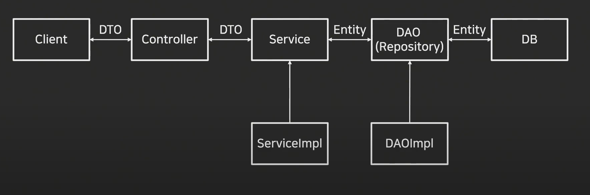

# DB

## Spring Boot 서비스 구조



## 요소

### Entity(Domain)

데이터베이스 쓰일 컬럼과 여러 엔티티 사이의 연관관계 정의</br>
데이터베이스의 테이블을 하나의 엔티티로 생각</br>
실제 데이터베이스 테이블과 1:1 매핑</br>
클래스의 필드는 각 테이블 내부의 컬럼을 의미

```java
// java 8까지는 javax.persistance지만 이후 버전부터는 jakarta로 이관되었다(라이센스, 커뮤니티 관리)

package com.test.tddtest.data.entity;

import jakarta.persistence.Entity;
import jakarta.persistence.Id;
import jakarta.persistence.Table;
import lombok.*;

@Entity
@Getter
@Setter
@NoArgsConstructor
@AllArgsConstructor
@Builder
@Table(name = "product")
public class ProductEntity {

    @Id
    String productId;
    String productName;
    Integer productPrice;
    Integer productStock;

}
```

### Repository

Entity에 의해 생성된 데이터베이스 에접근하는 메서드를 사용하기 위한 인터페이스</br>
JPA를 사용하게 되는 곳</br>
Service와 DB를 연결</br>
DB에 적용하고자 하는 CRUD를 정의하는 영역

```java
// JpaRepository 상속
// JpaRepository<Repository가 사용할 Entity, Entity의 primary값(Id값)>

package com.test.tddtest.data.repository;

import org.springframework.data.jpa.repository.JpaRepository;
import com.test.tddtest.data.entity.ProductEntity;

public interface ProdcutRepository extends JpaRepository<ProductEntity, String> {

}
```

### DAO(Data Access Object)

DB에 접근하는 객체를 의미(Persistance Layer)</br>
Service가 DB에 연결할 수 있게 해주는 역할</br>
DB를 사용하여 데이터를 조회하거나 조작하는 기능 전담

```java
// ProductDao
package com.test.tddtest.data.dao;

import com.test.tddtest.data.entity.ProductEntity;

public interface ProductDao {

    ProductEntity saveProduct(ProductEntity productEntity);

    ProductEntity getProduct(String productId);
}

```

```java
// ProductDaoImpl
package com.test.tddtest.data.dao.impl;

import com.test.tddtest.data.entity.ProductEntity;
import org.springframework.beans.factory.annotation.Autowired;
import org.springframework.stereotype.Service;
import com.test.tddtest.data.dao.ProductDao;
import com.test.tddtest.data.repository.ProductRepository;


@Service
public class ProductDaoImpl implements ProductDao {
    ProductRepository productRepository;

    @Autowired
    public ProductDaoImpl(ProductRepository productRepository){
        this.productRepository = productRepository;
    }

    @Override
    public ProductEntity saveProduct(ProductEntity productEntity) {
        productRepository.save(productEntity);
        return productEntity;
    }

    @Override
    public ProductEntity getProduct(String productId) {
        ProductEntity productEntity = productRepository.getReferenceById(productId);
        return productEntity;
    }
    // getById와 getReferenceById의 차이?: 성능과 프록시
}
```

#### getById와 getReferenceById?

- getById: EnetityManager 인터페이스에서 제공</br>
  Entity를 실제로 데이터베이스에서 로딩하여 persistance context에 올린다</br>
  DB에서 entity를 가져오기 때문에 필요한 모든 정보가 로드되고, 연관 Entity도 초기화된다

- getReferenceById: Entity에 대한 Proxy를 반환한다</br>
  실제 DB에서 로딩되지 않고, 해당 Entity의 식별자만 가진다. 데이터가 필요한 시점에 로딩</br>
  지연로딩(Lazy Loading)을 사용하여 실제 데이터를 필요 순간까지 미룬다

### DTO(Data Transfer Object)

DTO는 VO(Value Object)로 불리기도 하며, 계층간 데이터 교환을 위한 객체</br>
VO의 경우 Read-Only 성격

@Entity, @Table과 같은 경우에는 JPA를 설치해야 한다</br>

```java
// ProductDto
package com.test.tddtest.data.dto;

import com.test.tddtest.data.entity.ProductEntity;
import lombok.AllArgsConstructor;
import lombok.Builder;
import lombok.Data;
import lombok.NoArgsConstructor;

@Data
@NoArgsConstructor
@AllArgsConstructor
@Builder
public class ProductDto {

    private String productId;
    private String productName;
    private int productPrice;
    private int productStock;

    public ProductEntity toEntity() {
        return ProductEntity.builder()
                .productId(productId)
                .productName(productName)
                .productPrice(productPrice)
                .productStock(productStock)
                .build();
    }

}
```
