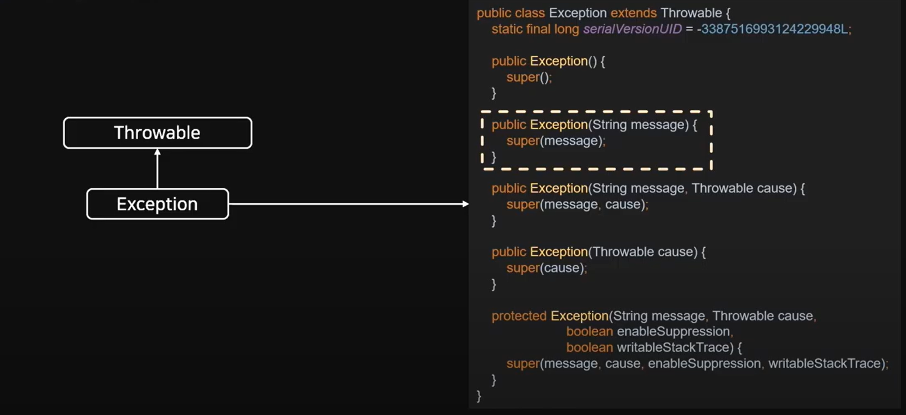
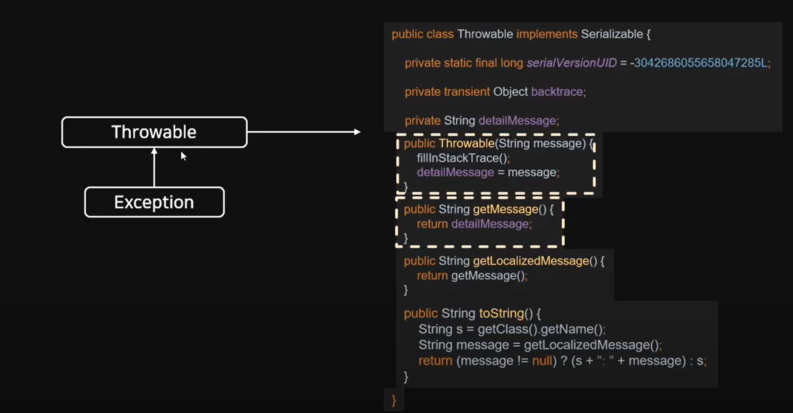

# 예외 처리(Exception)

## 스프링 부트 예외 처리 방식

- @ControllerAdvice를 통한 모든 Controller에서 발생할 수 있는 예외 처리:
  모든 컨트롤러에서 발생할 예외 정의

- @ExceptionHandler를 통한 특정 Controller의 예외 처리:
  해당 Annotation을 통해 발생하는 예외마다 처리할 메서드 정의

Checked Exception과 Unchecked Exception이 있다

## 예외 클래스

모든 예외 클래스는 Throwable 클래스를 상속받고 있다

Exception은 수 많은 자식 클래스가 있음

RuntimeException은 Uncehcked Exception이며, 그 외 Exception은 Checked Exception으로 볼 수 있음

|                           | Checked Exception             | Unchecked Exception                                                                                   |
| ------------------------- | ----------------------------- | ----------------------------------------------------------------------------------------------------- |
| 처리 여부                 | 반드시 예외 처리 필요         | 명시적 처리 강제하지 않음                                                                             |
| 확인 시점                 | 컴파일 단계                   | 실행 중 단계                                                                                          |
| 예외 발생시</br> 트랜잭션 | 롤백하지 않음                 | 롤백함                                                                                                |
| 대표 예외                 | IOException</br> SQLException | NullPointerException</br> IllegalArgumentException </br> IndexOutOfBoundException</br>SystemException |

## @ControllerAdvice, @RestControllerAdvice

@ControllerAdvice는 Spring에서 제공하는 Annotation

@Controller나 @RestController에서 발생하는 예외를 한 곳에서 관리하고 처리할 수 있게 하는 Annotation

설정을 통해 범위 지정이 가능하며 Default 값으로 모든 Controller에 대해 예외 처리를 관리</br>
@RestControllerAdvice(basePackages = "com.test.tddtest")와 같이 패키지 범위를 설정할 수 있음

예외 발생 시 Json 형태로 결과 반환을 위해서는 @RestControllerAdvice를 사용

@ControllerAdvice 와 @RestControllerAdvice의 차이점이기도 함

## @ExceptionHandler

예외 처리 상황이 발생하면 해당 Handler로 처리하겠다고 명시하는 Annotation

Annotation 뒤에 괄호를 붙여 어떤 ExceptionClass를 처리할 지 정할 수 있음</br>
@ExceptionHandler(BindException.class)

Exception.class는 최상위 클래스로 하위 세부 예외 처리 클래스로 설정한 핸들러가 존재하면, 그 핸들러가 우선 처리를 하게 되며, 처리 못하는 예외처리는 ExceptionClass에서 핸들링(하위부터 처리된다)

@ControllerAdvice로 설정된 클래스 내에서 메서드로 정의할 수 있지만, 각 Controller 안에 설정도 가능하다

전역 설정(EcontrollerAdvice) 보다 지역 설정(Controller)으로 정의한 Handler가 우선 순위를 가진다

## 우선순위

- 자식 클래스가 더 높은 우선순위를 가진다
- 컨트롤러 예외처리가 우선순위를 가진다(ControllerAdvice vs Controller)

# Custom Exception

## Exception의 구조



## Throwable의 구조



## HttpStatus?

Enum 클래스:

- 서로 관련 있는 상수들을 모아 심볼릭한 명칭의 집합으로 정의
- 클래스처럼 보이는 상수

```java
BAD_REQUEST(400, Series.CLIENT_ERROR, "Bad Request")
(value, series, resonPhrase)
```

## Custom Exception

- error type: httpStatus의 reasonPhrase
- error code: HttpStatus value
- message: 상황별 디테일한 Message
