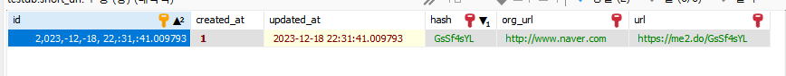

# JpaAuditing

## 자동으로 Entity에 값을 생성할 때 사용

```java
// BaseEntity

import jakarta.persistence.Column;
import jakarta.persistence.EntityListeners;
import jakarta.persistence.MappedSuperclass;
import lombok.Getter;
import lombok.Setter;
import org.springframework.data.annotation.CreatedDate;
import org.springframework.data.annotation.LastModifiedDate;
import org.springframework.data.jpa.domain.support.AuditingEntityListener;

import java.time.LocalDateTime;

@Getter
@Setter
@MappedSuperclass
@EntityListeners(AuditingEntityListener.class)
public class BaseEntity {

    @CreatedDate
    @Column(updatable = false)
    private LocalDateTime createdAt;

  /*
  @CreatedBy
  @Column(updatable = false)
  private String createdBy;
  */

    @LastModifiedDate
    private LocalDateTime updatedAt;

  /*
  @LastModifiedBy
  private String updatedBy;
  */

}

```

MappedSuperclass를 통해 다른 Entity에서 상속받을 때 자동 주입한다

`updateable = false`를 통해 처음 생성시에만 작성되게 만든다

```java
// ShortUrlEntity

import jakarta.persistence.*;
import lombok.*;

@Entity
@Getter
@Setter
@NoArgsConstructor
@AllArgsConstructor
@Builder
@Table(name = "short_url")
public class ShortUrlEntity extends BaseEntity {

    @Id
    @GeneratedValue(strategy = GenerationType.IDENTITY)
    private Long id;

    @Column(nullable = false, unique = true)
    private String hash;

    @Column(nullable = false, unique = true)
    private String url;

    @Column(nullable = false, unique = true)
    private String orgUrl;

}
```

다만, 저렇게만 써서는 안되고, 실행파일(Application.java)에서 등록을 해주어야 한다

```java
// HubToyApplication

import org.springframework.boot.SpringApplication;
import org.springframework.boot.autoconfigure.SpringBootApplication;
import org.springframework.data.jpa.repository.config.EnableJpaAuditing;

@SpringBootApplication
@EnableJpaAuditing
public class HubToyApplication {

	public static void main(String[] args) {
		SpringApplication.run(HubToyApplication.class, args);
	}

}
```

`EnableJpaAuditing` Annotation을 작성!

근데 왜 순서가 다르게 나오지?



해결방법:</br>
DB를 지웠다가 다시 깔았다... 이유는 잘 모르겠다
