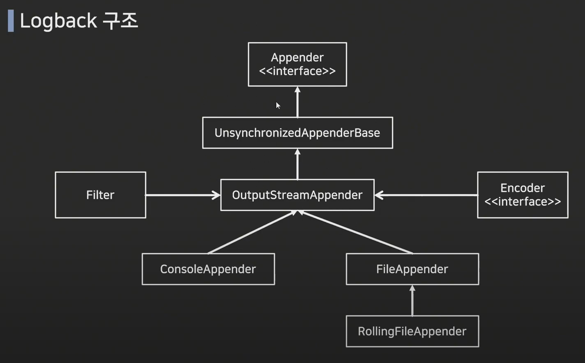
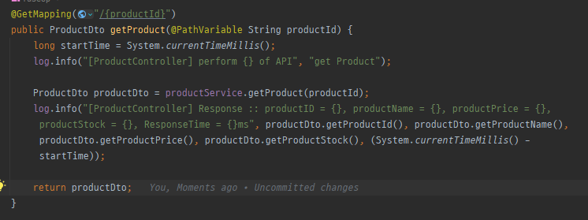

# Logback

## Logback이란?

Logback은 Log4J를 기반으로 개발된 Logging 라이브러리

log4j에 비해 10배 정도 빠른 퍼포먼스, 메모리 효율성 증대

log4j -> logback -> log4j2</br>
log4j2는 아직 레퍼런스가 적다

## Logback의 특징

- 로그에 특정 레벨을 설정할 수 있음(Trace > Debug > Info > Warn > Error)

- 실운영과 테스트 상황에서 각각 다른 출력 레벨을 설정하여 로그 확인 가능

- 출력 방식에 대해 설정할 수 있음

- 설정 파일을 일정 시간마다 스캔하여 중단 없이 설정 변경 가능

- 별도의 프로그램 없이 자체적으로 로그 압축 지원

- 로그 보관 기간 설정 가능

## Logback의 구조



### Appender

Log의 형태 및 어디에 출력할지 설정

대표적인 Appender 형식

- ConsoleAppender: 콘솔에 로그 출력
- FileAppender: 파일에 로그 저장
- RollingFileAppender: 여러 파일을 순회하며 로그 저장
- SMTPAppender: 로그를 메일로 전송
- DBAppender: DB에 로그 저장

### Encoder

Appender 내에 포함되는 항목이며, pattern을 사용하여 원하는 형식으로 로그 표현

### root

설정한 Appender를 참조하여 로그 레벨 설정

root는 전역 설정, 지역 설정을 위해서는 logger를 사용

## 로그 레벨

### ERROR

로직 수행 중 오류가 발생한 경우, 시스템적으로 심각한 문제가 발생하여 작동이 불가한 경우

### WARN

시스템 에러 원인이 될 수 있는 경고 레벨, 처리 가능한 사항

### INFO

상태 변경과 같은 정보성 메세지

### DEBUG

디버깅을 위한 메세지 레벨

### TRACE

DEBUG보다 더 디테일한 메세지를 표현하기 위한 레벨

로그 레벨을 INFO로 설정한 경우 TRACE, DEBUG 레벨은 출력되지 않음</br>
(하위는 출력이 되지 않는다)

## Pattern


## 사용


```java

private final Logger log = LoggerFactory.getLogger(ProductController.class);
// 이걸 선언해줘서 log 객체를 하나 생성한다
// logger를 사용할 클래스를 LoggerFactory 내에 인자로 넣어준다

    log.trace("log_trace");
    log.debug("log_debug");
    log.info("log_info");
    log.warn("log_warn");
    log.error("log_error");

```

그런데 출력 결과가 INFO, WARN, ERROR만 나온다?


따로 xml 설정을 해주지 않았는데 기본이 INFO인 것 같은느낌이라 설정을 해본다

TRACE, DEBUG로 했더니 나오긴 나오는 것 같은데 엄청많이 나온다


기본으로 INFO로 설정된 것을 확인했다

### 추가



System.currentTimeMillis()를 사용해 시간을 측정할 수도 있다

```yml
spring:
  jpa:
    properties:
      hibernate:
        show_sql: true
```

를 통해 sql 쿼리문도 확인하자!

또 신기한건, 중간에 위치가 길면 com.test.tddtest를 c.t.t와 같은 형식으로 알아서 줄여버린다
