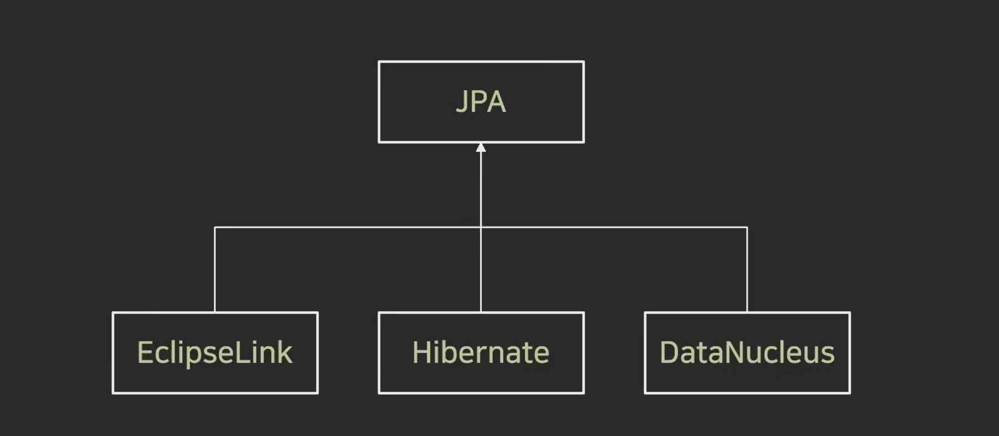

# ORM(Object Relational Mapping)

어플리케이션의 객체와 관계형 데이터베이스의 데이터를 자동으로 매핑 
Java의 데이터 클래스와 관계형 데이터베이스의 테이블 매핑

객체지향 프로그래밍과 관계형 데이터베이스의 차이로 발생하는 제약사항을 해결해주는 역할

JPA, Hibernate 등이 있음(Persistance API)

## ORM의 장점

### SQL 쿼리가 아닌 직관적 코드로 데이터 조작 가능

- 개발자가 보다 비즈니스 로직에 집중 가능(쿼리 작성 시간 단축)

### 재사용 및 유지보수가 편리

- ORM은 독립적으로 작성되어있어 재사용 가능 
  : 하나의 클래스로 작성되기 때문에 재사용성이 좋다
- 매핑정보를 명확하게 설계하기 때문에 따로 DB를 볼 필요 없음

### DBMS에 대한 종속성이 줄어듦

- DBMS를 교체하는 작업을 비교적 적은 리스크로 수행 가능

## ORM의 단점

### 복잡성이 커질 경우 ORM만으로 구현이 어려움

- 직접 쿼리를 구현하지 않아 복잡한 설계가 어려움

### 잘못 구현할 경우 속도 저하

- 작성된 코드를 컨버팅할 때 제대로 구현되있지 않으면 속도저하 발생

### 대형 쿼리는 별도 튜닝 필요

## JPA(Java Persistance API)

ORM과 관련된 인터페이스의 모음

Java 표준 ORM으로 채택

ORM이 큰 개념, JPA는 더 구체화한 스펙

### Hibernate

ORM Framework중 하나 
JPA의 실제 구현체 중 하나이며, JPA 구현체 중 가장 많이 사용

### Spring Data JPA

Spring Framework에서 JPA를 편리하게 사용하도록 지원하는 라이브러리

- CRUD 처리용 인터페이스 제공
- Repository 개발시 인터페이스만 작성하면 구현 객체를 동적으로 생성해서 주입
- 데이터 접근 계층 개발시 인터페이스만 작성해도 된다

Hibernate에서 자주 사용되는 기능을 쉽게 사용하도록 구현
