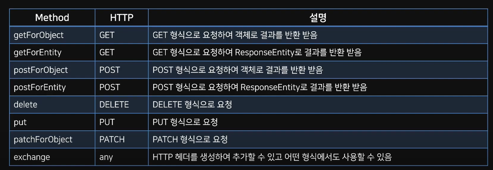

# RestTemplate

## RestTemplate?

스프링에서 제공하는 HTTP 통신 기능을 쉽게 사용할 수 있도록 설계된 템플릿

HTTP 서버와의 통신을 단순화하고 RESTful 원칙을 준수

- 동기:Rest Template
- 비동기: AsyncRestTemplate

RestTemplate 클래스는 REST 서비스를 호출하도록 설계되어 HTTP 프로토콜 메서드에 맞는 여러 메서드를 제공

## RestTemplate 메서드

